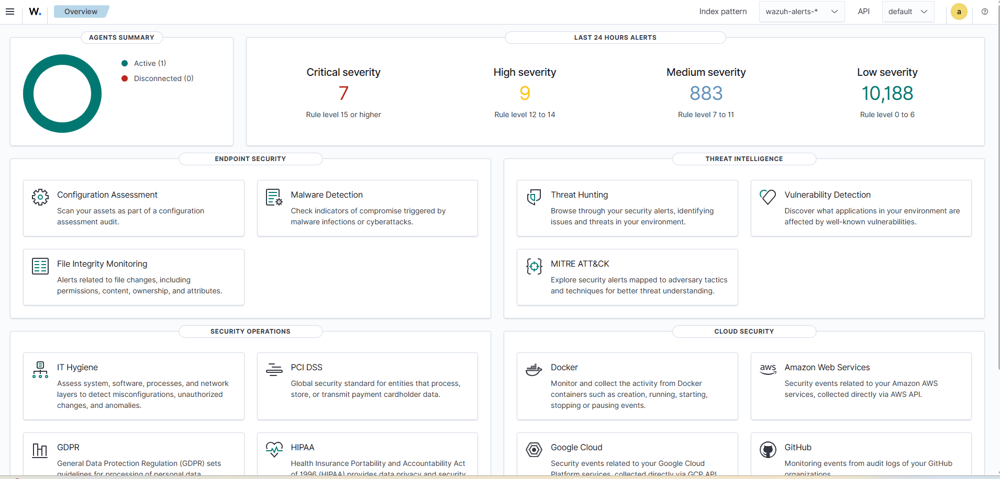
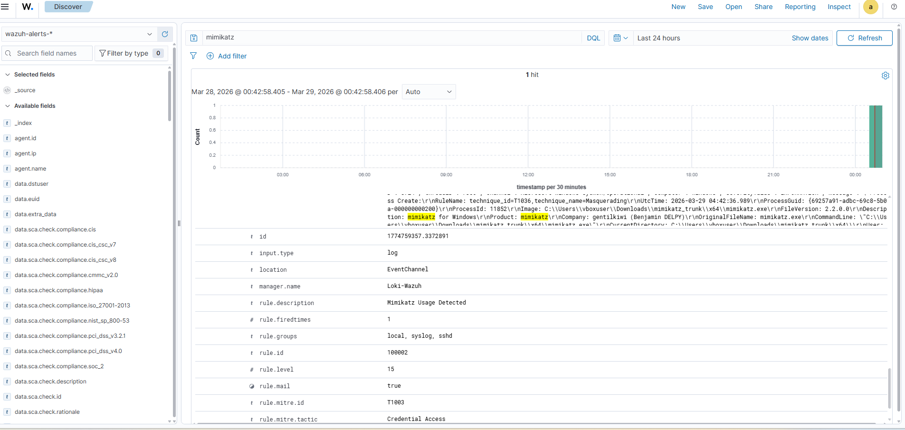
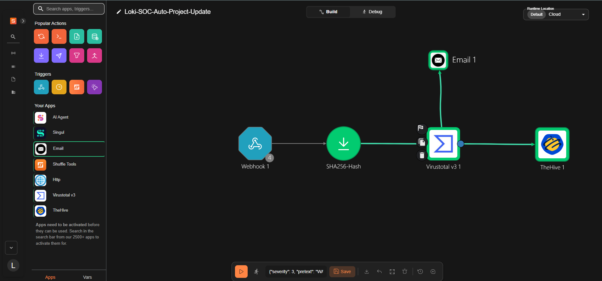
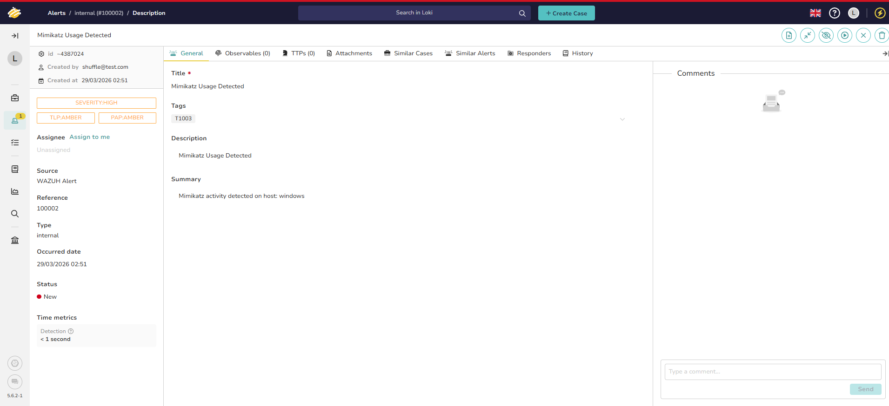

# SOC Automation Lab — End-to-End Threat Detection & Response Pipeline

A fully functional Security Operations Center (SOC) automation lab built from scratch.
This project simulates a real-world SOC environment where threats are automatically
detected, enriched, and escalated into incident cases without any manual intervention.

---

## 🎯 What This Project Does

When a threat is detected on an endpoint:

1. **Wazuh** detects the malicious activity and fires an alert
2. **Shuffle SOAR** receives the alert via webhook
3. **SHA256 hash** is automatically extracted from the alert
4. **VirusTotal** enriches the hash — is it known malware?
5. **TheHive** automatically creates a fully populated incident case
6. **Email notification** is sent to the analyst

**Detection to case creation: under 1 second.**

---

## 🏗️ Architecture


### Infrastructure

| Component | Details |
|---|---|
| Windows Host | Local machine — attacker simulation |
| Windows 11 VM | VMware — monitored endpoint |
| Wazuh Manager | Vultr Ubuntu VPS · 8GB RAM |
| TheHive | Vultr Ubuntu VPS · 12GB RAM |
| SOAR Platform | Shuffle (cloud) |

---

## 🛠️ Tools & Technologies

- **Wazuh** — Open source SIEM and XDR platform
- **TheHive** — Open source incident response platform
- **Shuffle SOAR** — Open source security automation
- **VirusTotal API** — Threat intelligence and file enrichment
- **Cassandra** — Backend database for TheHive
- **Elasticsearch** — Index engine for TheHive
- **VMware Workstation** — Windows 11 endpoint virtualization
- **Vultr** — Cloud VPS hosting
- **Ubuntu 24.04** — Server OS
- **Mimikatz** — Red team credential dumping simulation

---

## 📸 Screenshots

### Wazuh Dashboard

> Active agent monitoring with 7 critical, 9 high severity alerts.
> Full MITRE ATT&CK mapping and threat intelligence built in.

### Mimikatz Execution on Windows VM

> Mimikatz 2.2.0 executed on the monitored Windows 11 VM
> to simulate a real credential dumping attack.

### Wazuh Alert Firing

> Rule 100002 fired at Level 15 — Critical.
> MITRE ATT&CK T1003 — Credential Access detected instantly.

### Shuffle SOAR Workflow

> Automated pipeline: Webhook → SHA256 extraction →
> VirusTotal enrichment → TheHive case creation → Email alert.

### TheHive Case Auto-Created

> Case automatically created with full context.
> Severity HIGH · TLP:AMBER · Source: Wazuh Alert.
> Detection time: under 1 second.

---

## ⚙️ How It Works

### 1. Endpoint Monitoring
The Wazuh agent is installed on the Windows 11 VM and monitors
everything in real time — process executions, file changes,
network connections, and registry modifications.
Sysmon feeds detailed process telemetry into the Wazuh agent
for deeper visibility.

### 2. Alert Detection
When Mimikatz executes, Wazuh matches it against custom rule 100002.
The rule fires at level 15 — the highest severity — and maps
it to MITRE ATT&CK T1003, Credential Access technique.

### 3. SOAR Automation (Shuffle)
Wazuh sends the alert to Shuffle via webhook.
Shuffle extracts the SHA256 hash from the alert payload
and sends it to VirusTotal for threat intelligence enrichment.

### 4. Incident Case Creation (TheHive)
Shuffle takes the enriched data and automatically creates
a case in TheHive with:
- Alert title and description
- Severity and TLP classification
- MITRE ATT&CK technique tag
- Source host information
- VirusTotal enrichment results

### 5. Analyst Notification
An email is sent to the analyst the moment the case is created
so nothing sits unnoticed.

---

## 🚧 Challenges & Lessons Learned

This project did not go smoothly — and that was the point.

**Cassandra wouldn't start**
A stray `9` accidentally typed at the top of `cassandra.yaml`
broke the entire YAML parser. Two hours debugging a single character.

**TheHive kept crashing**
An IP address got accidentally typed into a comment line
in `application.conf`. TheHive failed on every startup attempt
with a cryptic config parse error.

**Elasticsearch rejecting connections**
Elasticsearch had SSL enabled by default. TheHive was sending
plain HTTP. Fixed by disabling xpack security in
`elasticsearch.yml` for the local lab environment.

**Wazuh agent showing Never Connected**
Port 1514 was not open on the Vultr firewall. The agent
was registered but couldn't phone home. Fixed by opening
TCP/UDP 1514 in the Vultr dashboard and UFW.

Every one of these errors taught me something a course never would.

---

## 🚀 Setup Guide

Full step by step setup guide is in [docs/setup_guide.md](docs/setup_guide.md)

---

## 📁 Repository Structure
```
SOC-Automation-Lab/
│
├── README.md
├── architecture/
│   └── SOC_Architecture.svg
├── screenshots/
│   ├── Wazuh_dashboard.png
│   ├── Wazuh.png
│   ├── Shuffle.png
│   ├── TheHive.png
│   └── Vm_windows.png
├── configs/
│   ├── wazuh_custom_rules.xml
│   └── shuffle_workflow.json
└── docs/
    └── setup_guide.md
```

---

## 🔗 References

- [Wazuh Documentation](https://documentation.wazuh.com)
- [TheHive Project](https://thehive-project.org)
- [Shuffle SOAR](https://shuffler.io)
- [MITRE ATT&CK T1003](https://attack.mitre.org/techniques/T1003/)
- [VirusTotal API](https://developers.virustotal.com)

---

## 👤 Lokesh Sivaprakash

Built by a cybersecurity grad student learning by doing.
Feel free to connect on https://www.linkedin.com/in/lokesh-sivaprakash/ or open an issue
if you're building something similar and get stuck.

---

## ⚠️ Disclaimer

This project is for educational purposes only.
Mimikatz and other tools used here were run in an
isolated lab environment. Never run these tools
on systems you do not own or have explicit permission to test.
